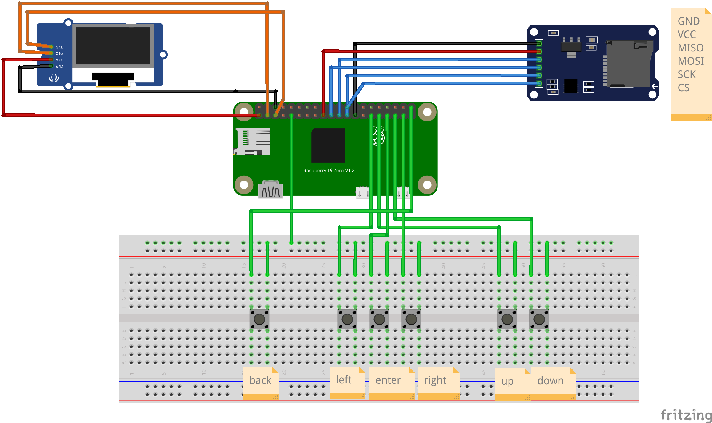
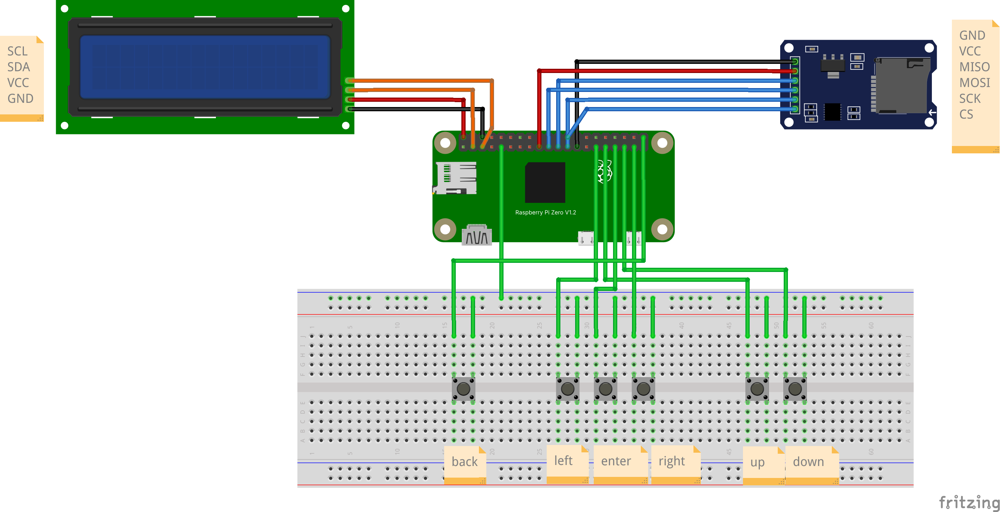
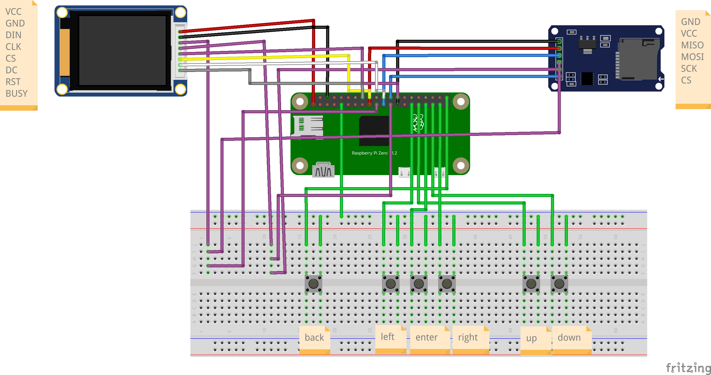

# Constrained UI Build Guide

This guide covers how to run the constrained text UI for SeedSigner on physical hardware. The architecture supports two distinct platforms: the **Raspberry Pi Zero** (running Linux/CPython) and the **ESP32-S3** (running MicroPython 1.27).

---

## 1. Raspberry Pi Zero (Recommended)

The Pi Zero is the standard SeedSigner target. We run the text UI engine directly in CPython using standard Linux I2C/SPI interfaces.

### 1.1 Requirements
- Raspberry Pi Zero (v1.3 or W)
- MicroSD Card with Bookworm Lite or Pi OS
- SSH Access enabled
- Connected Display (16x2 LCD, SSD1306 OLED, or Waveshare E-Paper)
- Passive Buzzer (optional, for audio feedback)
- 6x Tactile Push Buttons (for directional navigation)
- MicroSD card reader module (for PSBT workflows)

### 1.2 Wiring Schematic & Pinout

Wire your components to the Pi Zero exactly as shown in the diagrams below.

<details open>
<summary><b>1. OLED (SSD1306) Wiring</b></summary>
<br>



</details>

<details>
<summary><b>2. Character LCD Wiring</b></summary>
<br>



</details>

<details>
<summary><b>3. Waveshare E-Paper Wiring</b></summary>
<br>



</details>

### Complete Pin Mapping Summary

| Component | Physical Pin (1-40) | GPIO (BCM) | Notes |
| :--- | :--- | :--- | :--- |
| **SPI MicroSD** | VCC: `17`, GND: `39`, MOSI: `19`, MISO: `21`, SCK: `23`, CS: `24` | CS: `8` (CE0) | **CS** must be CE0 for `mmc-spi` compatibility. |
| **I2C Displays (OLED/LCD)** | VCC: `1` or `2`, GND: `6`, SDA: `3`, SCL: `5` | SDA: `2`, SCL: `3` | Use Pin 1 (3.3V) for OLED, Pin 2 (5V) for LCD. |
| **SPI E-Paper** | VCC: `1`, GND: `6`, MOSI: `19`, SCK: `23`, CS: `26`, DC: `18`, RST: `22`, BUSY: `16` | CS: `7` (CE1) | Shares `MOSI`/`SCK` with MicroSD. **CS** must be CE1! |
| **Push Buttons** | UP: `31`, DOWN: `35`, L: `29`, R: `37`, ENT: `33`, BACK: `40`, GND: `9` | UP: `6`, DN: `19`, L: `5`, R: `26`, ENT: `13`, BCK: `21` | All buttons share the same GND rail. |

### 1.3 Software Setup
1. Clone this repository onto your Pi using a shallow recursive clone. This pulls the upstream SeedSigner repository (Keith's LVGL fork's integration/lvgl-mpy branch) as a submodule:
   ```bash
   git clone --recursive --shallow-submodules --depth 1 https://github.com/aphrodoe/seedsigner-constrained-ui-runner.git
   cd seedsigner-constrained-ui-runner
   ```
   *(If you already cloned it without the flag, just run `./setup.sh` anyway, it will pull the submodule for you!)*

2. Run the automated setup script to build the virtual environment and install all dependencies:
   ```bash
   ./setup.sh
   ```
3. Enable I2C and SPI via `sudo raspi-config` (Interfacing Options).

### 1.4 Hardware Configuration & Sudoers

To enable stable SPI communication for the MicroSD card (without kernel timeout errors) and to allow the Python script to hot-swap cards without a root password, you must configure the Pi OS kernel and permissions.

1. **Kernel Overlays (`/boot/firmware/config.txt`)**
   Append these exact lines to enable the `mmc-spi` driver at 5MHz:
   ```text
   dtparam=spi=on
   dtoverlay=spi0-1cs
   dtoverlay=mmc-spi,spi0-0,brm=5000000
   ```
   *(Reboot required after changes).*

2. **Sudoers I/O Permissions**
   Create `/etc/sudoers.d/010_seedsigner-sd` with the following content to allow seamless mounting and kernel binding:
   ```bash
   pi ALL=(root) NOPASSWD: /usr/bin/mount -t vfat -o uid=1000\,gid=1000 /dev/mmcblk2p1 /mnt/sd
   pi ALL=(root) NOPASSWD: /usr/bin/umount /mnt/sd
   pi ALL=(root) NOPASSWD: /usr/bin/tee /mnt/sd/*
   pi ALL=(root) NOPASSWD: /usr/bin/mkdir -p /mnt/sd
   pi ALL=(root) NOPASSWD: /usr/bin/mv /mnt/sd/* /mnt/sd/*
   pi ALL=(root) NOPASSWD: /usr/bin/tee /sys/bus/spi/drivers/mmc_spi/unbind
   pi ALL=(root) NOPASSWD: /usr/bin/tee /sys/bus/spi/drivers/mmc_spi/bind
   ```

### 1.5 Hardware Testing
You can interact with the engine immediately using the hardware tester tool. This script dynamically pulls the exact dimensions of your display (e.g., 20x4 or 128x32) and starts a navigable UI session.

```bash
# Test on 128x32 OLED (SSD1306)
./tools/interactive_hardware_test.py --display oled

# Test on 16x2 Character LCD
./tools/interactive_hardware_test.py --display lcd16x2
```
### 1.6 Running the Full SeedSigner codebase
The repository comes with a bootstrap script (`run_seedsigner.py`) that securely imports the upstream SeedSigner code and automatically applies the Constrained UI monkey-patches at runtime, similar to Keith's work (https://github.com/kdmukAI-bot/seedsigner/blob/integration/lvgl-mpy/docs/architecture/view-to-screen-json-contract.md).

```bash
# Ensure your virtual environment is active
source venv/bin/activate

# Run the OS
python3 run_seedsigner.py
```

This replaces the standard LVGL graphical display with the constrained hardware outputs, providing a 1-to-1 functional mapping of the entire UI flow.

## 2. ESP32-S3 (Under Testing, will be updated soon)

Because our rendering engine separates state logic from hardware I/O, the entire text algorithm runs perfectly on MicroPython 1.27.

### 2.1 Requirements
- ESP32-S3 Development Board
- Display
- 6x Tactile Push Buttons (for directional navigation)
- `esptool` and `mpremote` installed on your host machine.

### 2.2 Flashing MicroPython
Download the latest MicroPython 1.27 firmware for your ESP32-S3 board.

1. Erase the flash:
   ```bash
   esptool.py --chip esp32s3 --port /dev/ttyUSB0 erase_flash
   ```
2. Write the firmware:
   ```bash
   esptool.py --chip esp32s3 --port /dev/ttyUSB0 write_flash -z 0 microPython-1.27-esp32s3.bin
   ```

### 2.3 Uploading the Codebase
We use `mpremote` to copy our pure-Python logic and MicroPython-specific hardware drivers to the ESP32.

```bash
# Copy the source code and scenario JSON
mpremote fs cp -r src/ :
mpremote fs cp -r scenarios/ :

# Copy the MicroPython entrypoint to the root so it runs on boot
mpremote fs cp mpy_main.py :main.py
```

### 2.4 Wiring & Pinout
By default, `mpy_main.py` expects the following wiring. (You can change these in the script).

**I2C Display (OLED or LCD):**
- **VCC:** 3.3V or 5V (Check your display specs)
- **GND:** GND
- **SDA:** GPIO 8
- **SCL:** GPIO 9

**Navigation Buttons (Wired to GND):**
- **UP:** GPIO 4
- **DOWN:** GPIO 5
- **LEFT:** GPIO 6
- **RIGHT:** GPIO 7
- **ENTER:** GPIO 15

### 2.5 MicroPython Native Drivers
To avoid CPython dependencies like `Pillow` or `smbus2`, we use custom native drivers on the ESP32:
- `src/drivers/lcd_i2c_mpy.py` uses `machine.I2C` for character LCDs.
- `src/drivers/framebuf_mpy.py` uses the built-in `framebuf.FrameBuffer` for pixel displays like the SSD1306 OLED, converting complex Unicode icons to ASCII fallbacks automatically.

---

## 3. Configuration (`config.json`)

The engine behavior and hardware initialization are controlled via `config.json` in the root of the runner directory. When running the main SeedSigner OS flow, this file must accurately reflect your hardware setup.

```json
{
  "display": {
    "type": "oled_128x32",
    "i2c_address": "0x3C",
    "i2c_bus": 1
  },
  "audio": {
    "enabled": false,
    "gpio_pin": 18
  },
  "input": {
    "type": "keyboard"
  }
}
```

### 3.1 Display Settings
* **`type`**: The specific hardware display being used. Supported types include:
  * `"oled_128x32"` - SSD1306 128x32 pixel OLED (I2C)
  * `"oled_128x64"` - SSD1306 128x64 pixel OLED (I2C)
  * `"lcd_16x2"` - Standard 16x2 character LCD with I2C backpack
  * `"lcd_20x4"` - Standard 20x4 character LCD with I2C backpack
  * `"epaper_200x200"` - Waveshare 1.54" E-Paper display (SPI)
* **`i2c_address`**: The I2C address of your display (e.g. `"0x3C"` for most OLEDs, `"0x27"` for most LCD backpacks).
* **`i2c_bus`**: The hardware I2C bus number (typically `1` for Raspberry Pi).

### 3.2 Audio Settings
* **`enabled`**: `true` or `false`. If enabled, the engine will trigger PWM buzzer sounds during specific screen events (like errors or success screens).
* **`gpio_pin`**: The BCM GPIO pin number the positive leg of the buzzer is connected to (e.g. `18`).

### 3.3 Input Settings
* **`type`**: The input driver to initialize.
  * `"keyboard"` - SSH/terminal keyboard listener (Maps WASD/Arrows to directions, Enter to select, and 'b' or ESC to back).
  * `"gpio"` - Standard SeedSigner GPIO push buttons (Requires physical buttons wired to the Pi).
  * `"none"` - Disables local inputs (useful for passive simulators).
